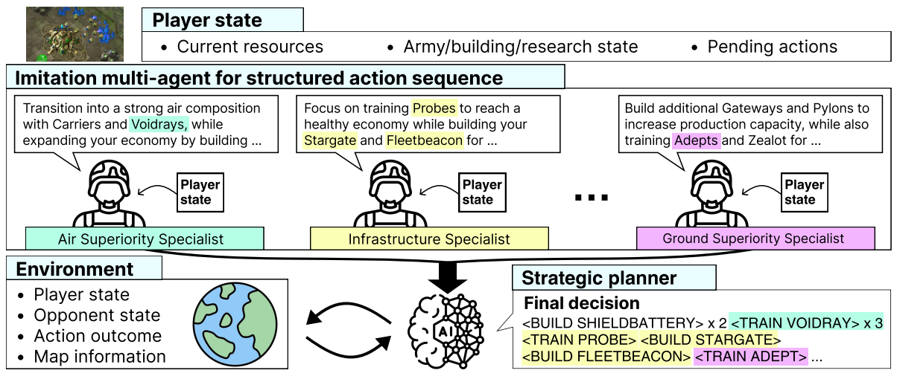

# Society of Mind Meets Real-Time Strategy: A Hierarchical Multi-Agent Framework for Strategic Reasoning

[`Daechul Ahn`](https://dcahn12.github.io/) | [`San Kim`](https://mounKim.github.io/) | [`Jonghyun Choi`](https://ppolon.github.io/)

 [[`Paper`](https://arxiv.org/abs/2508.06042)] | [[`huggingface`](https://huggingface.co/collections/SNUMPR/hima-68995479873aa6ebca249262)]



## Highlights

Our method (HIMA) shows strong performance in **StarCraft II**.

| Method             | Matchup | LV4 (MediumHard)  | LV5 (Hard) | LV6 (Harder) | LV7 (VeryHard)     | LV8 (CheatVision)  | LV9 (CheatMoney)   | LV10 (CheatInsane)     |
|--------------------|---------|----------|----------|---------|---------|---------|---------|---------|
| CoS (NeurIPS 2024) | PvZ     |   84%    |   55%    |   8%    |   0%    |   n/r     |   n/r     |   n/r     |
| HEP (arXiv 25'02)  | PvZ     |  100%    |   75%    |   75%   |   25%   |   n/r     |   n/r     |   n/r     |
| **HIMA (Ours)**    | PvZ     | **100%** | **92%** | **84%** | **82%** | **68%** | **20%** | **16%** |

> `n/r`: not reported in the original papers.<br>
> Bot difficulty levels (LV4–LV10) follow the naming and behavior defined in `python-sc2`.

To enable more comprehensive evaluation of strategic agents, we propose a new benchmark: **TextSC2-ALL**.
Unlike previous environments such as **TextStarCraft** (focused on PvZ) and **SwarmBrain** (focused on ZvT),  
**TextSC2-ALL** includes **all 9 possible matchups** among Protoss, Terran, and Zerg:


| Benchmark       | PvP | PvT | PvZ | TvP | TvT | TvZ | ZvP | ZvT | ZvZ |
|------------------|-----|-----|-----|-----|-----|-----|-----|-----|-----|
| TextStarCraft (NeurIPS 2024)    |     |     | ✅  |     |     |     |     |     |     |
| SwarmBrain (arXiv 24'01)      |     |     |     |     |     |     |     | ✅  |     |
| **TextSC2-ALL (Ours)** | ✅  | ✅  | ✅  | ✅  | ✅  | ✅  | ✅  | ✅  | ✅  |

## Latest updates
- **08/11/2025 -- HIMA codes are released!**
- **07/07/2025 -- We are happy that our project has been accepted by COLM 2025!**

## Install StarCraft II and setup maps

### Install StarCraft II
StarCraft II is a real-time strategy game developed by Blizzard.

To install it:

1. Download and install the Battle.net launcher from [Blizzard's official site](https://us.shop.battle.net/en-us).
2. Log in or create a Blizzard account.
3. Install **StarCraft II** through the Battle.net client.

> ⚠️ **Note:** <br>
> This project was developed and tested on Windows 10. The latest version of StarCraft II is not officially available on Linux.

### Download maps

To run the demo, you need to place the provided map file in the correct StarCraft II directory.

1. Locate the map file in this repository: `maps/Ancient Cistern LE.SC2Map`
2. Copy this file to your local StarCraft II Maps folder.  
The default path is typically: C:\Program Files (x86)\StarCraft II\Maps<br>
(If the Maps folder does not exist, please create it manually.)

> ⚠️ **Note:**  
> Our experiments were conducted only on the map _Ancient Cistern LE_.  
> If you use a different map, the agent may not work as expected because certain points in the code are hardcoded for this map.

## Setup environment

**First**, install dependencies.

```sh
git clone git@github.com:snumprlab/HIMA.git
conda create -n hima python=3.10
conda activate hima
# install HIMA
cd hima
pip install burnysc2 openai requests
```

---

**Second**, set your OpenAI API key to enable LLM-based agent reasoning.<br>
You can pass your API key as a command-line argument when running main.py.<br>
`--LLM_api_key YOUR_API_KEY`

---

**Third**, download our imitation-based agent from Hugging Face and launch it as a local server.  
👉 Model URL: [https://huggingface.co/SNUMPR/Protoss-a](https://huggingface.co/SNUMPR/Protoss-a)

Refer to `app.py` for an example of how to serve the model using **FastAPI**.  
The server runs on `localhost`, and the default port is `8080`.

You can change the port by passing the following argument to `main.py`:  
`--port YOUR_PORT`

---

You must download three separate models depending on the race you want to play.  
Each model plays a specific role in the agent's hierarchical control.

For example:

- **Protoss**:  
  `Protoss-a`, `Protoss-b`, `Protoss-c`

- **Zerg**:  
  `Zerg-a`, `Zerg-b`, `Zerg-c`

- **Terran**:  
  `Terran-a`, `Terran-b`, `Terran-c`

> ⚠️ **Note:**<br>
> Make sure all three models for the selected race are downloaded and running on the server.


## Run demo

### Game mode

You can run the game in two different modes by setting the `--mode` argument in `main.py`:
- **Agent vs BotAI**:  
  Run your agent against the built-in StarCraft II AI.  
  Use: `--mode bot`

- **Agent vs Agent**:  
  Run your agent against another agent (e.g., CoS, HEP, ...).  
  Use: `--mode agent`

**Note**: Using LLM to play StarCraft2 can take approximately 20 minutes for a single game.

## Citing our project
If you use our project in your research, please use the following BibTeX entry. 

```
@inproceedings{ahnKC25,
      author    = {Daechul Ahn and San Kim and Jonghyun Choi},
      title     = {Society of Mind Meets Real-Time Strategy: A Hierarchical Multi-Agent Framework for Strategic Reasoning},
      booktitle = {COLM},
      year      = {2025}
}
